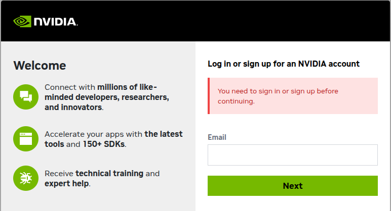
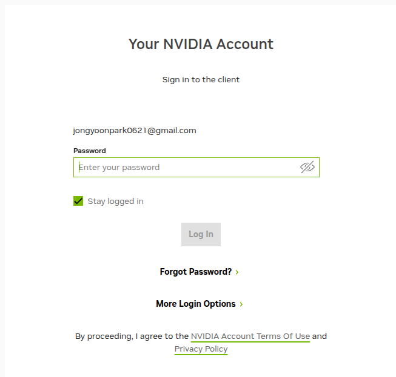
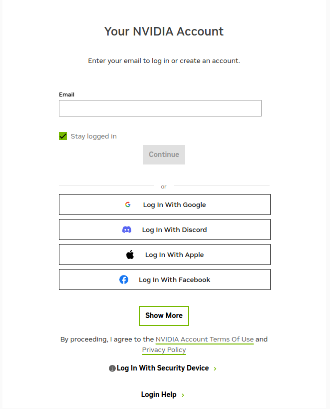
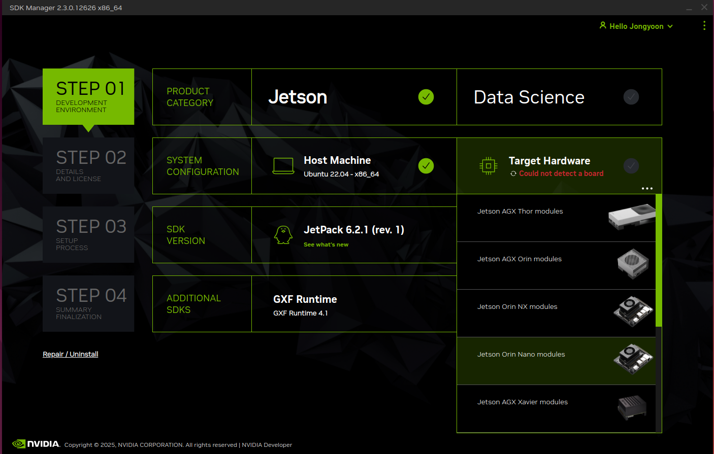
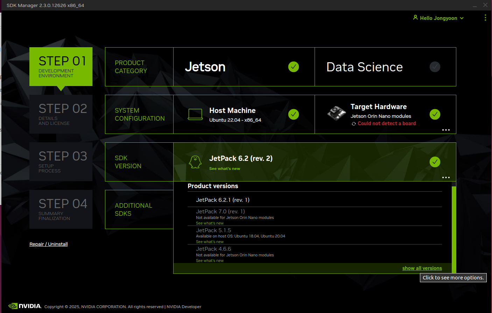
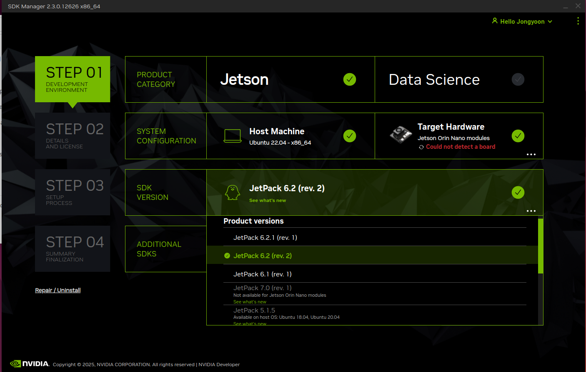
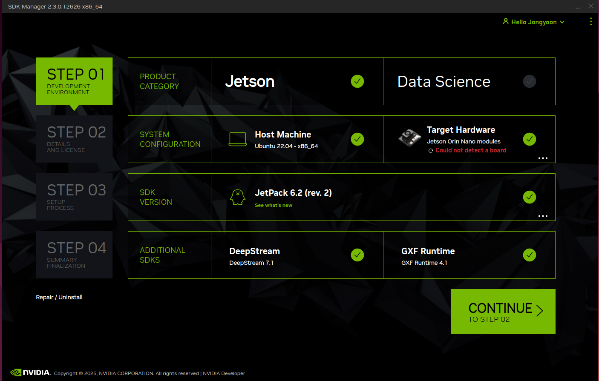

# Jetson Installation

## First, have to download [NVIDIA SDK MANAGER](https://developer.download.nvidia.com/sdkmanager/redirects/sdkmanager-deb.html)

- Login with your *Google email*

    </img>

- Click *More Login Options* and login with your *Google Account*
    
    </img></img>

## Second, install **NVIDIA SDK MANAGER** on Ubuntu
- Install the deb file with *Software Install*

    <video src="https://github.com/user-attachments/assets/df798cf2-462c-4dd4-85b9-fc139d39096d"></video>
- Run sdk manager

    <video src="https://github.com/user-attachments/assets/135593f6-331c-4dad-b199-144f7e886dc7"></video>
    
## Finally, download *Jetpack* for Jetson Orin Nano 8GB
- Login with Account and Select **Target Hardware**

    </img>

- Select SDK Version and click the highlighted ***show all version*** at the bottom

    </img>

- Select JetPack 6.2 by following image:

    </img>

- Check *ADDITIONAL SDKS*, it will look like the following image:

    </img>

- Click the Continue button. On STEP 02, check the two buttons at the bottom as shown in the video below.

    <video src="https://github.com/user-attachments/assets/64c46dd5-c936-4a37-af2d-44b246235766"></video>

- The installation is complete. Click the finish button and exit.

    </img>s